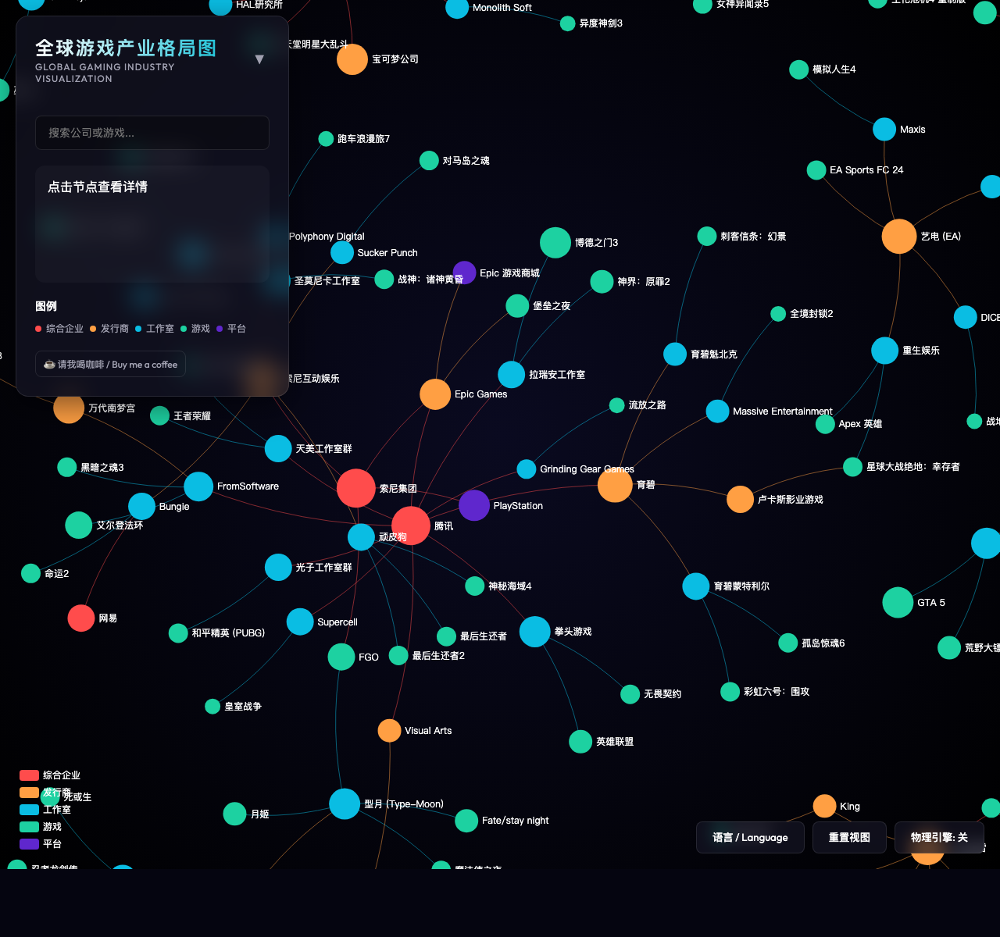

# 全球游戏产业格局图 / Global Gaming Industry Map

> 交互式全球游戏产业关系图谱 — 一张图看懂谁拥有谁、谁开发了什么。
> An interactive map of the global gaming industry — who owns whom, who made what.

**在线访问 / Live demo:** <https://gaming-industry-map.vercel.app>



## 简介 (中文)

本项目用力导向图（force-directed graph）可视化全球游戏产业的格局，覆盖 **200+ 节点、170+ 关系**：

- **综合企业**：腾讯、索尼集团、微软、任天堂、网易、Embracer、Valve、CyberAgent……
- **平台**：PlayStation、Xbox、Switch、Steam、Epic 游戏商城、App Store、Google Play
- **发行商 / 工作室**：EA、育碧、Take-Two、卡普空、世嘉、万代南梦宫、FromSoftware、顽皮狗、拉瑞安、米哈游、游戏科学、Type-Moon、Key 社、Falcom……
- **代表作品**：《原神》《艾尔登法环》《博德之门3》《黑神话：悟空》《塞尔达传说：王国之泪》《空洞骑士：丝之歌》等

关系类型包括 **收购、投资（含持股比例）、开发、发行、授权与合作**。

### 功能

- 🔍 **搜索定位**：输入公司或游戏名即可高亮，按回车打开详情
- 🌐 **中英双语**：一键切换，偏好自动记忆（localStorage）
- 🔗 **分享链接**：点击节点后 URL 自动带上 `#node=<id>`，可直接分享当前选中节点
- 📋 **节点详情**：侧边栏展示类别与全部关联关系
- ⚙️ **物理引擎开关**、视图重置、自由缩放平移

## About (English)

An interactive force-directed graph of the global gaming industry landscape: conglomerates (Tencent, Sony, Microsoft, Nintendo…), platforms (PlayStation, Xbox, Switch, Steam…), publishers, studios and landmark games, connected by **ownership, investment, development, publishing and licensing** relationships.

**Features:** bilingual UI (中文/English) with persisted preference, search with Enter-to-select, shareable deep links (`#node=Tencent`), per-node detail panel, physics toggle, pan & zoom.

## 技术栈 / Tech Stack

- [Apache ECharts 6](https://echarts.apache.org/) — graph rendering (force layout)
- [Vite 6](https://vite.dev/) — dev server & bundling
- Vanilla JavaScript (ES modules), no framework
- Deployed on [Vercel](https://vercel.com/)

## 本地开发 / Local Development

```bash
npm ci          # install dependencies
npm run dev     # dev server at http://localhost:5173
npm run build   # production build to dist/
npm run preview # preview the production build
```

## 数据与来源 / Data & Sources

所有数据维护在 [`src/data/gameData.js`](src/data/gameData.js)（节点 + 关系，中英双语字段）。数据为人工整理，主要参考公开新闻与维基百科；产业变动频繁，**如发现过时或错误信息，欢迎提 Issue / PR 指正**。

All data lives in [`src/data/gameData.js`](src/data/gameData.js) (nodes + links with bilingual fields), curated manually from public news and Wikipedia. The industry moves fast — issues and PRs fixing outdated facts are very welcome.

## 支持 / Support

如果这个项目对你有帮助，可以 [☕ 请我喝咖啡 / buy me a coffee](https://ko-fi.com/snownamida)。

## 许可 / License

[MIT](LICENSE) © Snownamida
